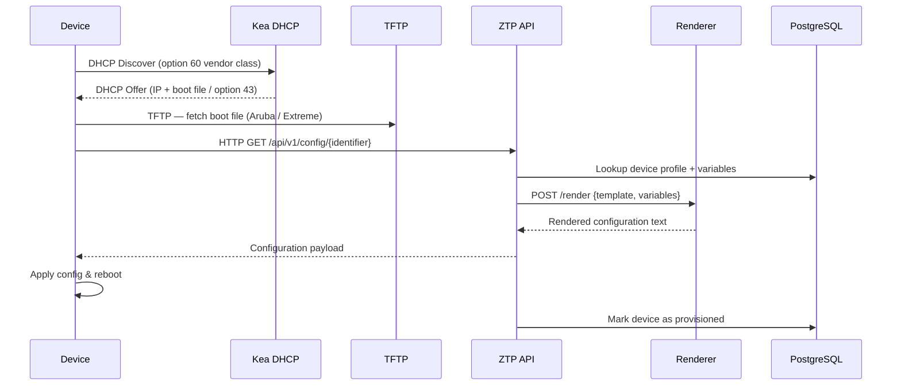
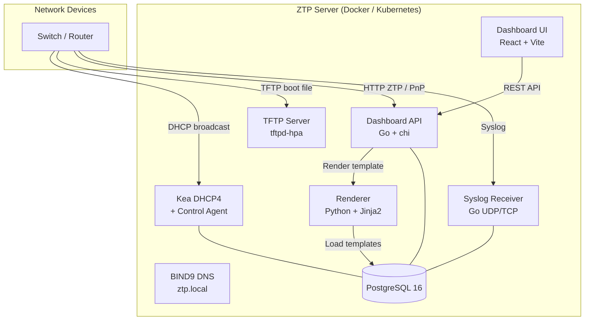

# ZTP Server

> **Zero-Touch Provisioning** — network switches and routers configure themselves on first boot. No console cables. No manual CLI. No per-device scripts.

ZTP Server is a self-hosted, multi-vendor provisioning platform that automatically detects new network hardware, renders a personalised configuration from a Jinja2 template, and pushes it to the device — all before a human has touched a keyboard.

---

## How it works

A new switch powers on and broadcasts a DHCP request. From that moment, ZTP Server takes over:



For **Cisco PnP** devices, the API speaks the full PnP XML protocol. For **Juniper**, the API serves a Junos-compatible config directly. For **Aruba / HP ProCurve**, a TFTP-hosted boot file handles initial provisioning.

---

## Features

| Capability | Detail |
|---|---|
| **Multi-vendor** | Cisco IOS / IOS-XE (PnP), Juniper Junos, Aruba AOS-CX / ProCurve, Extreme, Fortinet |
| **Auto-discovery** | Devices appear in the dashboard the moment they send a DHCP request — no pre-registration required |
| **Template engine** | Jinja2 templates with syntax highlighting editor, variable discovery, and DB-backed storage |
| **Customer hierarchy** | Customers → Profiles → Devices. Profile variables cascade down, device variables override |
| **Live inventory** | Management IP resolved from live DHCP leases in real-time |
| **Web terminal** | Browser-based SSH terminal to any provisioned device, proxied through the API |
| **Config export** | Download rendered (deployed) config or pull the live running config from the device via SSH |
| **Syslog** | UDP/TCP syslog receiver — provisioning events update device status automatically |
| **OIDC auth** | Azure AD / Okta / any OIDC provider, with local username/password fallback |
| **Kubernetes ready** | Helm-compatible manifests included. Kea runs as a DaemonSet with `hostNetwork: true` for DHCP broadcast |

---

## Architecture



---

## Services

### `dashboard/api` — Go REST API
The brain of the system. Handles device authentication, template rendering requests, PnP negotiation, and the management dashboard API. JWT-secured with OIDC support.

### `dashboard/ui` — React Dashboard
Full management interface. Live device inventory, template editor with Jinja2 syntax highlighting, customer/profile hierarchy, DHCP lease viewer, syslog event stream, and browser SSH terminal.

### `renderer` — Python / FastAPI
Stateless Jinja2 rendering service. Accepts a template (from DB or filesystem) and a variable map, returns rendered text. Also exposes a variable-discovery endpoint that uses the Jinja2 AST to enumerate all variables in a template without executing it.

### `kea` — DHCP4
ISC Kea with the Control Agent and flex-option hook. Classifies devices by DHCP option 60 (vendor class identifier) and sets option 43 / boot file accordingly. Writes leases directly to PostgreSQL.

### `syslog` — Go syslog receiver
Listens on UDP 514 and TCP 601. Parses RFC 5424/3164 syslog frames and stores them in PostgreSQL. Watches for provisioning keywords to automatically update device status.

### `tftp` — tftpd-hpa
Serves boot files for TFTP-based vendors (Aruba ProCurve, Extreme). Files live in `services/tftp/tftpboot/`.

### `bind` — DNS
Internal DNS zone `ztp.local` so devices can resolve the ZTP server by name rather than IP.

---

## Quick start

### Prerequisites
- Docker + Docker Compose
- A flat L2 network segment where the ZTP server can receive DHCP broadcasts

### 1. Clone and configure

```bash
git clone https://github.com/your-org/ztp-server.git
cd ztp-server
cp .env.example .env
# Edit .env — set POSTGRES_PASSWORD, JWT_SECRET, and optionally OIDC_* vars
```

### 2. Start the stack

```bash
docker compose up -d
```

The dashboard is available at `http://<server-ip>` · Default credentials: `admin` / `Admin1234!`

### 3. Configure your network

Point your DHCP scope's next-server (option 66) and boot file (option 67) at the ZTP server, or let Kea handle it natively if you use the included Kea container.

Update `services/kea/config/kea-dhcp4.json` with your subnet and gateway:

```json
{
  "subnet4": [{
    "subnet": "10.0.0.0/24",
    "pools": [{ "pool": "10.0.0.100-10.0.0.200" }],
    "option-data": [
      { "name": "routers", "data": "10.0.0.1" }
    ]
  }]
}
```

### 4. Add a template

In the dashboard, go to **Templates → New Template**. Paste your Jinja2 config and save. Variables are auto-discovered from the template AST.

### 5. Create a profile

Go to **Profiles → New Profile**. Select your template, hit **Discover from template** to populate variable fields, fill in the values, and save.

### 6. Watch devices provision themselves

Power on a device. It appears in **Devices** within seconds, progresses through `Discovered → Provisioning → Provisioned`, and the rendered config is available for download.

---

## API reference

All endpoints (except device ZTP endpoints and `/health`) require a Bearer token obtained from `/api/v1/auth/login`.

### Authentication

```http
POST /api/v1/auth/login
Content-Type: application/json

{ "username": "admin", "password": "Admin1234!" }
```

```json
{
  "token": "eyJ...",
  "expires": 1712345678,
  "user": { "id": "...", "username": "admin", "role": "admin" }
}
```

### Inventory

```http
GET /api/v1/inventory
Authorization: Bearer <token>
```

Returns all devices with their live management IP resolved from DHCP leases, profile, and customer assignments.

```json
[
  {
    "id": "d3f1a...",
    "hostname": "sw-core-01",
    "mac": "98:49:25:b1:b2:2e",
    "serial": "jx3623030103",
    "vendor_class": "juniper",
    "status": "provisioned",
    "management_ip": "10.144.10.102",
    "profile_name": "EX2300 Standard",
    "customer_name": "Acme Corp"
  }
]
```

### Devices

| Method | Path | Description |
|--------|------|-------------|
| `GET` | `/api/v1/devices` | List all devices |
| `POST` | `/api/v1/devices` | Create device |
| `GET` | `/api/v1/devices/{id}` | Get device |
| `PUT` | `/api/v1/devices/{id}` | Update device |
| `DELETE` | `/api/v1/devices/{id}` | Delete device |
| `GET` | `/api/v1/devices/{id}/config` | Download deployed (rendered) config |
| `GET` | `/api/v1/devices/{id}/running-config` | Pull live running config via SSH |

### Templates

| Method | Path | Description |
|--------|------|-------------|
| `GET` | `/api/v1/templates` | List templates |
| `POST` | `/api/v1/templates` | Create template |
| `GET` | `/api/v1/templates/{id}` | Get template |
| `PUT` | `/api/v1/templates/{id}` | Update template |
| `DELETE` | `/api/v1/templates/{id}` | Delete template |
| `GET` | `/api/v1/templates/{id}/variables` | Discover Jinja2 variables via AST |

### Profiles & Customers

| Method | Path | Description |
|--------|------|-------------|
| `GET` | `/api/v1/profiles` | List profiles |
| `POST` | `/api/v1/profiles` | Create profile |
| `PUT` | `/api/v1/profiles/{id}` | Update profile |
| `DELETE` | `/api/v1/profiles/{id}` | Delete profile |
| `GET` | `/api/v1/customers` | List customers |
| `POST` | `/api/v1/customers` | Create customer |
| `PUT` | `/api/v1/customers/{id}` | Update customer |
| `DELETE` | `/api/v1/customers/{id}` | Delete customer |

### ZTP endpoints (unauthenticated — called by devices)

| Method | Path | Vendor |
|--------|------|--------|
| `GET` | `/api/v1/config/{mac_or_serial}` | Generic HTTP ZTP |
| `GET` | `/juniper/{serial}/config` | Juniper ZTP |
| `GET` | `/aruba/config` | Aruba / HP |
| `POST` | `/pnp/HELLO` | Cisco PnP |
| `POST` | `/pnp/WORK-REQUEST` | Cisco PnP |
| `POST` | `/pnp/WORK-RESPONSE` | Cisco PnP |

---

## Vendor support

### Cisco IOS / IOS-XE
Uses the Cisco Plug-and-Play (PnP) protocol over HTTP. The API responds to `HELLO`, `WORK-REQUEST`, and `WORK-RESPONSE` messages and delivers a rendered IOS config.

### Juniper Junos
Device is classified by DHCP option 60 (`Juniper`) and directed to `/juniper/{serial}/config` via DHCP option 43. Renders a Junos set-format or hierarchical config.

### Aruba AOS-CX / HP ProCurve
ProCurve firmware is TFTP-only — devices are auto-registered via lease polling and served a boot script via TFTP. AOS-CX supports HTTP ZTP.

---

## Environment variables

| Variable | Description | Default |
|----------|-------------|---------|
| `POSTGRES_HOST` | PostgreSQL host | `postgres` |
| `POSTGRES_DB` | Database name | `ztp` |
| `POSTGRES_USER` | DB user | `ztp` |
| `POSTGRES_PASSWORD` | DB password | — |
| `JWT_SECRET` | HS256 signing key | — |
| `JWT_EXPIRY` | Token lifetime | `24h` |
| `RENDERER_URL` | Internal renderer URL | `http://renderer:8000` |
| `OIDC_ENABLED` | Enable OIDC auth | `false` |
| `OIDC_ISSUER` | OIDC issuer URL | — |
| `OIDC_CLIENT_ID` | OIDC client ID | — |
| `OIDC_CLIENT_SECRET` | OIDC client secret | — |
| `OIDC_REDIRECT_URL` | OAuth callback URL | — |

---

## Kubernetes

Manifests are in `k8s/`. Kea runs as a DaemonSet with `hostNetwork: true` so it can receive DHCP broadcasts. TFTP, Syslog, and DNS use `LoadBalancer` services. The API, UI, and renderer scale horizontally.

```bash
kubectl apply -f k8s/secrets/secrets.yaml   # fill in base64 values first
kubectl apply -f k8s/
```

---

## License

MIT
